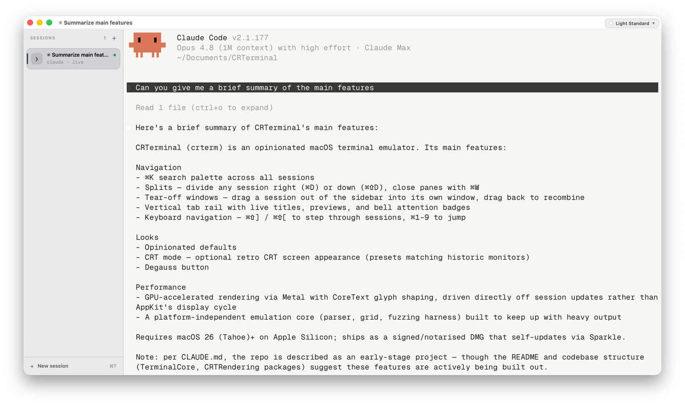
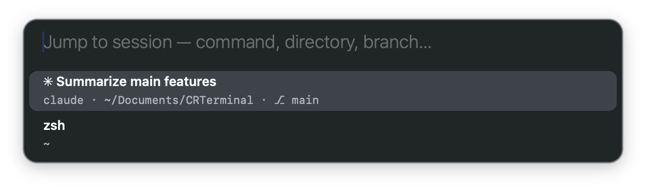
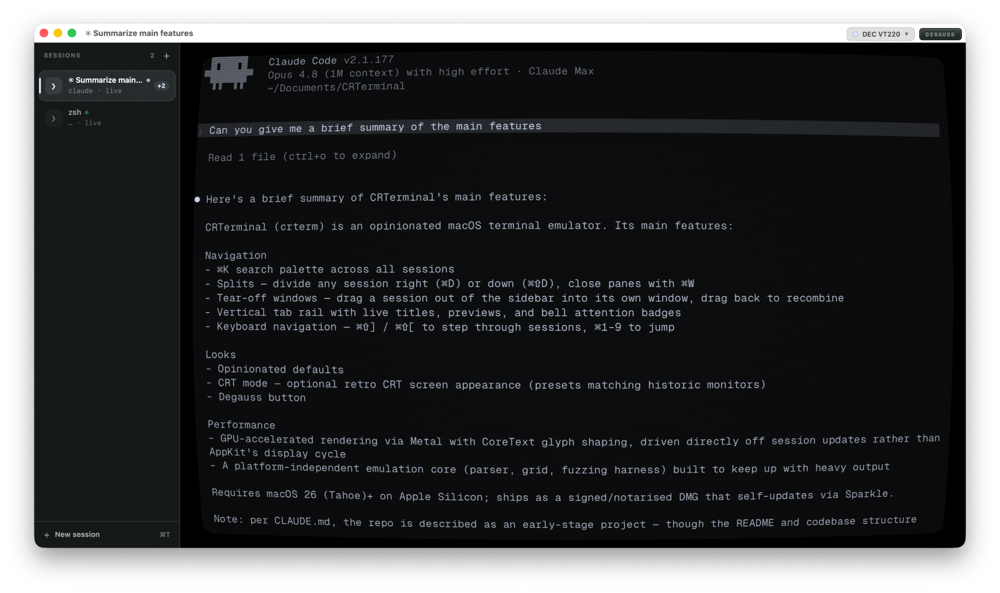

# crterm

> A beautifully opinionated terminal emulator with a modern approach to navigating tabs.



## Navigating

- **⌘K** Search palette over all sessions 
- **⌘⇧K / ⌘⌥K** Search command history — the focused terminal's, or every
  terminal's — and recall a command to the prompt. Shell integration is
  auto-injected for zsh, so it works out of the box.
- **Splits** Divide any session right (⌘D) or down (⌘⇧D) and close panes with ⌘W.
- **Tear-off windows** Drag a session out of the sidebar to pop it into its own
  window; drag it back to recombine.
- **Vertical tab rail** Live titles, preview and bell attention badges.
- **Move by keyboard.** ⌘⇧] / ⌘⇧[ to step through sessions, ⌘1–9 to leap to one.
- **Rebind anything.** Every app shortcut above is customisable — open Settings
  and record a new combination for it under *Keyboard shortcuts*.



## Looks

- **Opinionated defaults**
- **CRT mode** 
- **Degauss**



## Built for speed

GPU-accelerated rendering via Metal with CoreText glyph shaping, driven directly
off session updates rather than AppKit's display cycle. The emulation core is a
platform-independent engine with its own parser, grid, and fuzzing harness,
kept fast enough to keep up with the noisiest output. Performance numbers live in
[PERF.md](PERF.md).

## Install

Requires **MacOS 26 (Tahoe)** or later, Apple Silicon.

Download the latest signed, notarised build:

**[CRTerminal.dmg](https://github.com/mbcltd/CRTerminal/releases/latest/download/CRTerminal.dmg)**

Open the disk image and drag **crterm** to Applications. The app updates itself
in place via [Sparkle](https://sparkle-project.org) — or check manually from
**crterm → Check for Updates…**.

## Build from source

```sh
Scripts/build.sh            # Debug build; add `release` for Release
Scripts/test.sh             # run the test suites CI runs
```

See [ARCHITECTURE.md](ARCHITECTURE.md) for the design and [RELEASING.md](RELEASING.md)
for how releases are signed, notarised, and published.

## License

Licensed under the [Apache License 2.0](LICENSE).

---

© 2026 Morgan Brown Consultancy Ltd · [morgan-brown.com](https://morgan-brown.com)
